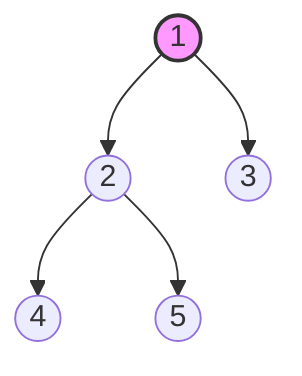
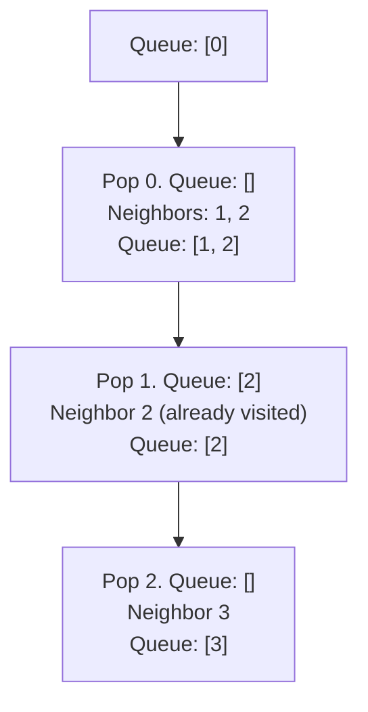

# 🌲 Tree & 🕸️ Graph Mastery Guide
> [!NOTE]
> This guide is designed to take you from a level of copying/pasting tree and graph solutions to building an intuitive, visual understanding of these structures. Don't worry—recursion and pointer manipulation will become your superpower!

---

## 🗺️ The Core Difference: Tree vs. Graph

Before diving in, let's understand how they relate:
* A **Tree** is just a restricted type of **Graph**! 
* Specifically, a Tree is a **connected, acyclic (no cycles) directed/undirected graph**.
* In a Tree, there is exactly **one path** between any two nodes. In a Graph, you can have multiple paths, loops, or even disconnected components.

```mermaid
graph TD
    subgraph Tree (Acyclic, Hierarchy)
        T1((Root)) --> T2((Left Child))
        T1 --> T3((Right Child))
        T2 --> T4((Leaf))
        T2 --> T5((Leaf))
    end

    subgraph Graph (Cycles & Connections)
        G1((Node A)) --- G2((Node B))
        G2 --- G3((Node C))
        G3 --- G1
        G3 --- G4((Node D))
    end
```

---

## 🌲 Part 1: Trees (Recursion is the Key)

The biggest mistake students make is trying to think of the entire Tree at once. Instead, remember this rule:
> [!IMPORTANT]
> **Every node in a tree is the root of its own subtree.**
> If you can solve a problem for a single node (assuming you already have the answers from its left and right children), you can solve it for the entire tree using **Recursion**!

### 1. Structure of a Binary Tree Node
In C++, a node looks like this:
```cpp
struct TreeNode {
    int val;
    TreeNode *left;
    TreeNode *right;
    TreeNode(int x) : val(x), left(NULL), right(NULL) {}
};
```

### 2. The 3 Types of DFS Traversals
DFS (Depth First Search) goes deep before going wide. There are three standard orders:
1. **Pre-order (Root, Left, Right)**: Used to copy trees or serialize them.
2. **In-order (Left, Root, Right)**: In a Binary Search Tree (BST), this always gives sorted order!
3. **Post-order (Left, Right, Root)**: Used for deletion or calculating attributes like height (where you need child information first).


* **Pre-order:** `1 -> 2 -> 4 -> 5 -> 3`
* **In-order:** `4 -> 2 -> 5 -> 1 -> 3`
* **Post-order:** `4 -> 5 -> 2 -> 3 -> 1`

### 3. Visualizing Recursion: Finding Tree Height
Let's see how simple recursion is. To find the height of a tree:
1. If the node is `NULL`, its height is `0`.
2. Otherwise, find `left_height` and `right_height`.
3. The height of the current node is `1 + max(left_height, right_height)`.

```cpp
int maxDepth(TreeNode* root) {
    if (root == NULL) return 0; // Base Case
    
    int leftHeight = maxDepth(root->left);   // Recursively find left height
    int rightHeight = maxDepth(root->right); // Recursively find right height
    
    return 1 + max(leftHeight, rightHeight); // Add 1 for the current node
}
```

---

## 🕸️ Part 2: Graphs (Adjacency Lists & Traversals)

In Trees, you always start at the `root` and go down. In Graphs, there is no single root, and you can get stuck in loops (cycles).

### 1. How is a Graph Represented?
The most common way is an **Adjacency List** (an array of vectors).
If we have 4 vertices (0, 1, 2, 3) and edges: `0-1`, `0-2`, `1-2`, `2-3`:

```cpp
// adjacencyList[u] contains all neighbors of vertex u
vector<vector<int>> adj(4);
adj[0] = {1, 2};
adj[1] = {0, 2};
adj[2] = {0, 1, 3};
adj[3] = {2};
```

### 2. Breadth-First Search (BFS) - Level Order
BFS is like a ripple in water. It explores neighbors level-by-level using a **Queue**.
> [!TIP]
> **BFS Formula:**
> 1. Push starting node to Queue, mark it as `visited`.
> 2. While Queue is not empty:
>    - Pop front node `curr`.
>    - For each unvisited neighbor of `curr`, mark `visited` and push to Queue.



```cpp
void bfs(int start, vector<vector<int>>& adj) {
    vector<bool> visited(adj.size(), false);
    queue<int> q;
    
    q.push(start);
    visited[start] = true;
    
    while (!q.empty()) {
        int curr = q.front();
        q.pop();
        cout << curr << " ";
        
        for (int neighbor : adj[curr]) {
            if (!visited[neighbor]) {
                visited[neighbor] = true;
                q.push(neighbor);
            }
        }
    }
}
```

### 3. Depth-First Search (DFS) - Depth Exploration
DFS explores as far as possible along each branch before backtracking. It uses recursion (which implicitly uses the Call Stack).

```cpp
void dfsHelper(int node, vector<vector<int>>& adj, vector<bool>& visited) {
    visited[node] = true;
    cout << node << " ";
    
    for (int neighbor : adj[node]) {
        if (!visited[neighbor]) {
            dfsHelper(neighbor, adj, visited);
        }
    }
}

void dfs(int start, vector<vector<int>>& adj) {
    vector<bool> visited(adj.size(), false);
    dfsHelper(start, adj, visited);
}
```

---

## 🎯 Phase 1 Practice Roadmap (Let's Solve These!)

We will solve these together step-by-step. Don't look at solutions online! We will write them from scratch.

| Topic | Problem No. | Problem Name | Learning Goal | Status |
| :--- | :--- | :--- | :--- | :--- |
| **Tree** | 104 | Maximum Depth of Binary Tree | Basic recursion base-case and bottom-up building | ⏳ Todo |
| **Tree** | 226 | Invert Binary Tree | Swapping pointers recursively | ⏳ Todo |
| **Tree** | 112 | Path Sum | Passing values down recursively | ⏳ Todo |
| **Graph** | 733 | Flood Fill | Matrix traversal using DFS/BFS (Easy entry) | ⏳ Todo |
| **Graph** | 200 | Number of Islands | Connected components on a grid | ⏳ Todo |

---

### 🚀 How We Will Study:
1. I will explain the logic of **Tree Depth** and we will code it together.
2. You will write the code (or we will write it together in your workspace template).
3. We will move to Graphs and draw the grid representation so you can easily visual it.

Whenever you're ready, say **"Start Tree Depth"**!
